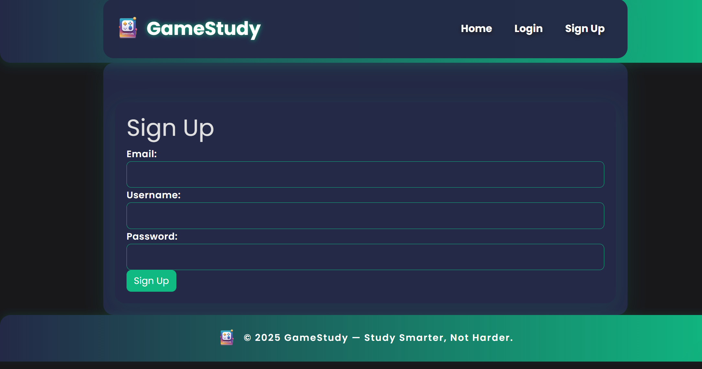

# GameStudy App

A **Gamified Study Tracking Application** that helps users track study sessions, earn XP, complete challenges, and unlock achievements, making studying more engaging and rewarding.

---

## Project Overview

The **Gamified Study Tracking App** is designed to make studying more productive and enjoyable by turning your academic progress into a game. Users can log study sessions by subject and duration, earning XP (experience points) for every minute studied. The app assigns daily challenges to keep users motivated and offers a variety of achievements to unlock as you reach new milestones.
A personalized dashboard displays your total study time, XP, streaks, and completed challenges. Compete with friends and classmates on the leaderboard, and analyze your study habits with built-in analytics. The app also supports profile customization, including avatars.

This app allows users to:
- Log study sessions with subjects and durations  
- Track total study time and accumulate XP  
- Complete daily challenges and unlock achievements  
- Securely manage accounts with Two-Factor Authentication (2FA)  
- View progress with a fun, gamified interface

---

## Final Gantt Chart

> **Note:** Replace the placeholder below with your actual Gantt chart when available.


---

## Project Report

View the full project report here:  
[Project Report PDF (placeholder)](path/to/project-report.pdf)

---

## Agile Sprints Summary

| Sprint   | Summary                                   | Branch Link                          |
| -------- | ----------------------------------------- | ------------------------------------- |
| Sprint 1 | User Authentication & Setup                 | [Sprint 1 Branch](https://github.com/TempeHS/2025SE-Cameron.L-Major/tree/sprint-1)            |
| Sprint 2 | Study Session Logging and UI                     | [Sprint 2 Branch](https://github.com/TempeHS/2025SE-Cameron.L-Major/tree/sprint-2)   |
| Sprint 3 | Achievements System                | [Sprint 3 Branch](https://github.com/TempeHS/2025SE-Cameron.L-Major/tree/sprint-3)      |
| Sprint 4 | Leaderboards and Competitive Features          | [Sprint 4 Branch](https://github.com/TempeHS/2025SE-Cameron.L-Major/tree/sprint-4)    |
| Sprint 5 | Profile Management & Avatars + Gamification Aspects         | [Sprint 5 Branch](https://github.com/TempeHS/2025SE-Cameron.L-Major/tree/sprint-5)         |
| Sprint 6 | UI Polish + Advanced Features e.g. Challenges               | [Sprint 6 Branch](https://github.com/TempeHS/2025SE-Cameron.L-Major/tree/sprint-6)       |
| Sprint 7 | Bug Fixes and Analytics Page          | [Sprint 7 Branch](https://github.com/TempeHS/2025SE-Cameron.L-Major/tree/sprint-7)        |
| Sprint 8 | Final Cleanup, Documentation & Feedback   | [Sprint 8 Branch](https://github.com/TempeHS/2025SE-Cameron.L-Major/tree/sprint-8)           |

---

## Installation & Setup

⚠️ **IMPORTANT:**  
You must sign up yourself. This system uses **Two-Factor Authentication (2FA)**, which generates a unique authentication code for each user.  
A working username and password **cannot be provided**, as the 2FA code is linked to your personal device.  
Please follow the **Sign Up** process below to create your own account.

### 1. Install Dependencies

Make sure Python is installed, then run:

```bash
pip install -r requirements.txt
python main.py
```

---

## User Guide: How to Log In

This app uses **Two-Factor Authentication (2FA)** for secure login. Follow these steps to create an account and log in:

### Step 1: Sign Up

1. Open the app and go to the **Sign Up** page.  
   
2. Fill in your desired **username**, **email**, and **password**.  
3. Submit the form to create your account.  
4. A **QR code** will be displayed — scan this with your **Google Authenticator** app.
   

### Step 2: Set Up Two-Factor Authentication (2FA)

1. Open the **Google Authenticator** app on your phone.  
2. Tap **"Scan QR Code"** and scan the QR code shown.  
3. Your app will start generating **6-digit authentication codes** for this account.

### Step 3: Logging In

1. Go to the **Login** page.  
   
2. Enter your **username or email** and **password**.  
3. Submit the form.  
4. Enter the **6-digit 2FA code** from your Google Authenticator app when prompted.

---

## Security Features

- **CSRF Protection** for all forms  
- **Brute Force Mitigation** to prevent login attacks  
- **Two-Factor Authentication (2FA)** using Google Authenticator  
- **Secure Password Storage** with hashing  
- **Input Validation & XSS Prevention**  

---